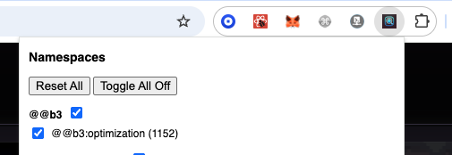
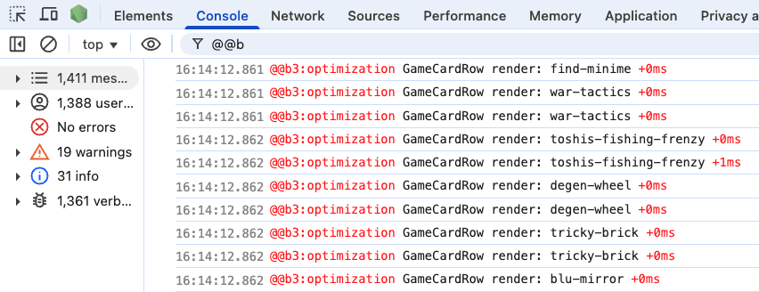

# Namespace Debugger 🔍

A Chrome extension for selectively managing and visualizing `debug`-style logs in real time — complete with counts, filters, groups, and toggles.

---

### ⚙️ Features

- 🧠 **Auto-detects debug namespaces** used in your app
- ✅ **Enable/disable namespaces** via checkboxes
- 🔢 **Live message counts** next to each namespace
- 🧹 **Reset to wildcard (`*`)**
- 📂 **Group namespaces** by prefix
- 🧲 **Sticky storage** with localStorage + Chrome sync
- ⛏️ Built specifically for apps using the [`debug`](https://www.npmjs.com/package/debug) NPM package

---

### 🧪 Example

    import debug from 'debug';

    const log = debug('app:login');
    log('Login start');

You’ll see a checkbox for `app:login` inside the extension’s popup, with a live message count and toggle.

---

### 📦 Installation

1. Clone or download this repo.
2. Open `chrome://extensions/`
3. Enable "Developer mode"
4. Click "Load unpacked"
5. Select the extension folder

---

### 🧩 Usage

- Click the extension icon
- View all detected debug namespaces
- Toggle visibility per-namespace
- Click “Reset” to enable all (`*`)
- Click “Toggle All Off” to silence everything

---

### 👨‍💻 Built for Devs

Created to simplify log filtering during debugging in modern apps.  
Ideal for use with tools like `next.js`, `express`, `feathers`, and other Node/browser projects.

---

### 🧠 Future Features

- Fuzzy search
- Group-level toggles
- Export logs
- Dark mode

---

### 🔗 License

MIT
